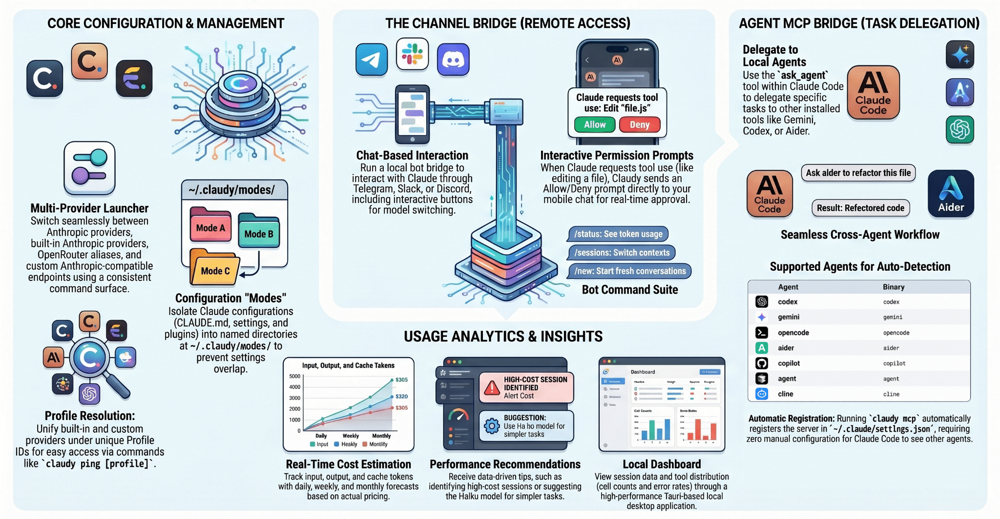
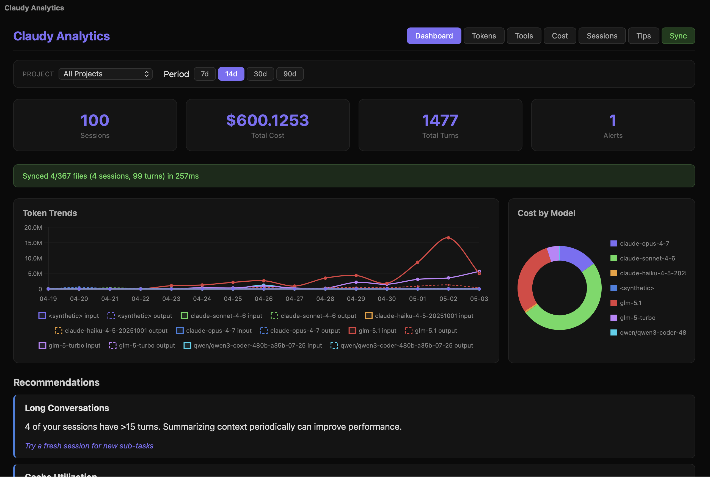

[← English](../../README.md)

<p align="center">
  <a href="README_ko.md">🇰🇷 한국어</a> •
  <a href="README_zh.md">🇨🇳 中文</a> •
  <a href="README_ja.md">🇯🇵 日本語</a> •
  <a href="README_de.md">🇩🇪 Deutsch</a> •
  <a href="README_fr.md">🇫🇷 Français</a> •
  <a href="README_es.md">🇪🇸 Español</a> •
  <a href="README_hi.md">🇮🇳 हिन्दी</a> •
  <a href="README_pt.md">🇧🇷 Português</a> •
  <a href="README_id.md">🇮🇩 Bahasa</a> •
  <a href="README_ar.md">🇸🇦 العربية</a>
</p>

<h1 align="center">claudy</h1>

<p align="center"><b>Lanzador multi-proveedor moderno para Claude CLI.</b></p>

---

<p align="center">
Claudy te permite ejecutar Claude con múltiples providers a través de una interfaz de comandos unificada, manteniendo las credenciales de cada provider y las superposiciones de configuración de Claude organizadas bajo un único directorio principal.
</p>

<p align="center">
    <a href="https://www.rust-lang.org/"></a>
    <a href="https://crates.io/crates/claudy"></a>
    <a href="https://crates.io/crates/claudy"></a>
    <a href="../../LICENSE"></a>
    <a href="https://buymeacoffee.com/epicsaga"></a>
</p>

---



## Por qué Claudy

- **Lanzamiento multi-proveedor**: cambia entre el provider integrado, Z.AI, alias de OpenRouter, Ollama y endpoints personalizados compatibles con Anthropic.
- **Config modes**: aísla la configuración de Claude (`CLAUDE.md`, `settings.json`, skills/plugins/agents) por Mode.
- **Resolución de Profile de provider**: unifica providers integrados, providers personalizados y aliases de OpenRouter.
- **Comportamiento seguro del proceso**: reenvía SIGINT/SIGTERM al proceso hijo de Claude.
- **UX operacional**: comandos de instalación/actualización/desinstalación, verificaciones de estado y pruebas de conectividad.
- **Channel bridge opcional**: ejecuta un bot bridge local para Telegram, Slack y Discord con solicitudes de permisos interactivas.
- **Agent MCP bridge**: delega tareas desde Claude Code a otros agentes de IA locales (Gemini, Codex, Aider, etc.) a través de MCP.
- **Analíticas de uso**: ingiere datos de sesión desde `~/.claude/projects/`, rastrea el uso de tokens y costos por sesión/proyecto, y muestra un dashboard local con recomendaciones.

## Estado de los Providers

> Claudy fue inspirado por [Clother](https://github.com/jolehuit/clother), un lanzador multi-proveedor basado en Go para Claude CLI. **Solo el provider Z.AI ha sido completamente probado**. Todos los demás providers alternativos son experimentales y no han sido probados — úsalos bajo tu propio riesgo.

| Provider | Estado | Notas |
|---|---|---|
| Built-in (Anthropic) | ✅ Probado | Por defecto |
| Z.AI | ✅ Probado | Completamente validado |
| OpenRouter alias | ⚠️ Experimental | No probado — úsalo bajo tu propio riesgo |
| Ollama | ⚠️ Experimental | No probado — úsalo bajo tu propio riesgo |
| Custom endpoint | ⚠️ Experimental | No probado — úsalo bajo tu propio riesgo |

## Requisitos

- macOS o Linux
- Toolchain de Rust (`cargo`) para compilar/instalar desde el código fuente
- Claude CLI instalado y disponible en `PATH`

## Instalación

### Instalar desde crates.io

**Binario precompilado (rápido, sin compilación)**

```
cargo install cargo-binstall
cargo binstall claudy
```

**Cualquier plataforma — compilar desde el código fuente**

```
cargo install claudy
```

**MacOS homebrew**

```bash
brew tap epicsagas/tap
brew install claudy
```

### Instalar desde el código fuente local

```bash
git clone https://github.com/epicsagas/claudy.git
cd claudy
cargo install --path .
```

### Verificar

```bash
claudy --help
claudy --version
```

## Inicio Rápido

```bash
# 1) Listar profiles disponibles/resueltos
claudy ls

# 2) Configurar credenciales de forma interactiva
claudy setup

# 3) Ver los detalles de un profile
claudy show <profile>

# 4) Ejecutar Claude con un profile
claudy <profile> [claude-args...]
```

## Conceptos Fundamentales

### Profile

Un objetivo de lanzamiento que resuelve metadatos del provider y la estrategia de autenticación (provider integrado, alias de OpenRouter o provider personalizado).

### Mode

Un directorio de configuración de Claude con nombre, ubicado en `~/.claudy/modes/<name>/`.

Cuando ejecutas:

```bash
claudy <profile> <mode> [args...]
```

Claudy establece:

```bash
CLAUDE_CONFIG_DIR=~/.claudy/modes/<mode>/
```

para que Claude lea los archivos de configuración específicos del Mode.

## Referencia de Comandos

### Comandos principales

- `claudy ls` (alias: `list`): lista los profiles configurados/resueltos.
- `claudy setup [provider]` (alias: `config`): configuración interactiva del provider.
- `claudy show <profile>` (alias: `info`): muestra los detalles resueltos del provider.
- `claudy ping [profile]` (alias: `test`): prueba la conectividad del provider.
- `claudy doctor` (alias: `status`): muestra la versión, rutas y cantidad de profiles.
- `claudy sync` (alias: `install`): instala/sincroniza el binario de claudy.
- `claudy update`: actualiza claudy.
- `claudy uninstall`: elimina los archivos instalados.
- `claudy mode <action> [name]`: gestiona los Config Modes de Claude.
- `claudy channel <subcommand>`: gestiona el Channel bridge.
- `claudy mcp`: ejecuta como servidor MCP para el Agent bridge.
- `claudy analytics <subcommand>`: dashboard de analíticas de uso.

### Comandos de Mode

```bash
claudy mode create <name>
claudy mode ls
claudy mode rm <name>
```

Regla de nombre del Mode: `[a-z0-9][a-z0-9_-]*` (`mode` está reservado).

### Comandos de Channel (bridge opcional)

```bash
claudy channel start [--profile <profile>] [--listen <host:port>]
claudy channel stop
claudy channel restart
claudy channel status
claudy channel add <telegram|slack|discord>
claudy channel remove <telegram|slack|discord>
claudy channel enable <telegram|slack|discord>
claudy channel disable <telegram|slack|discord>
```

`channel add` te guía a través de la configuración del token del bot, usuarios permitidos, profile y asignación de Mode.

#### Plataformas compatibles

| Plataforma | Ingesta | Botones interactivos | Notas |
|----------|-----------|-------------------|-------|
| Telegram | Long-polling + webhook | Teclado inline | Más completo |
| Slack | Webhook de suscripción a eventos | Acciones de Block Kit | Verificado con HMAC-SHA256 |
| Discord | Webhook de interacción | Componentes de Action row | Verificado con Ed25519 |

#### Comandos del bot de Channel

Una vez en funcionamiento, el bot responde a estos comandos en el chat:

- `/help` — Muestra los comandos disponibles
- `/cancel` — Cancela la tarea actual
- `/model` — Cambia el modelo de Claude (botones interactivos)
- `/yolo` — Activa/desactiva la auto-aprobación de permisos
- `/status` — Muestra el estado de la sesión, profile, Mode, rama de git y uso de tokens
- `/sessions` — Lista las sesiones recientes de Claude (con botones para cambiar)
- `/projects` — Lista los proyectos (con botones para navegar)
- `/new` — Inicia una nueva sesión
- `/history` — Muestra el historial de sesiones recientes

Envía cualquier otro texto para hablar directamente con Claude.

#### Solicitudes de permisos

Cuando Claude solicita aprobación para usar una herramienta (ejecutar un comando, editar un archivo, etc.), el bot envía una solicitud interactiva de Permitir/Denegar a tu chat. Al tocar un botón, la respuesta se envía de vuelta a Claude y el procesamiento continúa automáticamente.

#### Secretos

Guarda las credenciales en `~/.claudy/secrets.env`:

```env
TELEGRAM_BOT_TOKEN=...
SLACK_BOT_TOKEN=xoxb-...
SLACK_SIGNING_SECRET=...
DISCORD_BOT_TOKEN=...
DISCORD_APPLICATION_ID=...
DISCORD_PUBLIC_KEY=...
```

### Agent MCP bridge

Ejecuta `claudy mcp` para iniciar un servidor MCP basado en stdio que permite a Claude Code delegar tareas a otros agentes de IA instalados localmente.

```bash
claudy mcp
```

En el primer arranque, claudy se registra automáticamente en `~/.claude/settings.json`. Cuando creas un Mode con `claudy mode create <name>`, también se registra en el archivo de configuración del Mode. No se necesita configuración manual.

Para registrar manualmente (o en un `.claude/settings.json` a nivel de proyecto):

```json
{
  "mcpServers": {
    "claudy": {
      "command": "claudy",
      "args": ["mcp"]
    }
  }
}
```

Claude Code verá una herramienta `ask_agent` que expone todos los agentes instalados.

#### Ejemplo de uso

Una vez registrado, Claude Code puede delegar tareas de la siguiente manera:

```
> Ask gemini to review the error handling in src/api.rs
> Ask codex to write unit tests for the parser module
> Ask aider to refactor the database layer
```

Claude Code selecciona el agente apropiado, pasa el prompt y devuelve el resultado. También puedes especificar un directorio de trabajo:

```json
{ "agent": "gemini", "prompt": "Explain this module", "working_directory": "/path/to/project" }
```

#### Verificar el registro MCP

```bash
# Verificar si claudy está registrado
cat ~/.claude/settings.json | grep -A3 claudy

# Probar el servidor MCP manualmente
echo '{"jsonrpc":"2.0","id":1,"method":"initialize","params":{}}' | claudy mcp
```

#### Agentes compatibles (detectados automáticamente desde PATH)

| Agente | Binario | Comando headless |
|-------|--------|-----------------|
| Gemini CLI | `gemini` | `gemini -p "..." --output-format text` |
| Codex CLI | `codex` | `codex exec "..."` |
| Cursor Agent | `agent` | `agent -p "..." --output-format text` |
| GitHub Copilot | `copilot` | `copilot -p "..."` |
| OpenCode | `opencode` | `opencode run "..."` |
| Cline | `cline` | `cline -y "..."` |
| Aider | `aider` | `aider --message "..."` |
| Goose | `goose` | `goose run "..."` |
| Amp | `amp` | `amp --non-interactive "..."` |
| Droid | `droid` | `droid exec "..."` |
| Kiro | `kiro-cli` | `kiro-cli chat --no-interactive --trust-all-tools "..."` |
| Junie | `junie` | `junie "..."` |
| Kimi Code | `kimi` | `kimi "..."` |
| Mistral Vibe | `vibe` | `vibe "..."` |
| Qwen Code | `qwen-code` | `qwen-code "..."` |
| Crush | `crush` | `crush "..."` |
| Groq Code | `groq-code` | `groq-code --prompt "..."` |
| Plandex | `plandex` | `plandex tell "..."` |
| Kilo Code | `kilo` | `kilo "..."` |
| OpenHands | `openhands` | `openhands "..."` |

#### Agentes personalizados

Agrega agentes en `~/.claudy/config.yaml`:

```json
{
  "agents": {
    "my-agent": {
      "binary": "my-agent",
      "args": ["--prompt", "{prompt}", "--no-interactive"],
      "description": "My custom agent",
      "timeout": 180
    }
  }
}
```

La misma clave que un agente integrado reemplaza sus valores predeterminados. `{prompt}` en `args` se reemplaza con la tarea real.

### Comandos de Analytics

> **Nota**: La función de analytics aún está en desarrollo. Los conteos de tokens, las estimaciones de costos y otras métricas pueden no ser completamente precisas. Se esperan mejoras en próximas versiones.

```bash
claudy analytics dashboard         # Abrir el dashboard de analytics local (Tauri 2)
claudy analytics ingest            # Ingerir datos de sesión desde ~/.claude/projects/
claudy analytics ingest --full     # Reingerir todos los archivos (ignorar checkpoints)
claudy analytics ingest --project my-project  # Ingerir un proyecto específico
claudy analytics recommend         # Mostrar recomendaciones de uso en CLI
claudy analytics export            # Exportar datos de analytics (JSON, últimos 30 días por defecto)
claudy analytics export --format csv --days 7  # Exportar como CSV para los últimos 7 días
```

Analytics rastrea:

- **Tokens**: Tendencias detalladas de tokens de entrada, salida y caché durante los últimos 30 días, agrupados por modelo y fecha.
- **Tools**: Análisis de distribución que muestra qué herramientas usa Claude con más frecuencia, incluyendo conteos de llamadas, tasas de error y tiempo de ejecución promedio.
- **Costo**: Estimación en tiempo real de los costos de uso basada en los precios reales de tokens, incluyendo previsiones diarias/semanales/mensuales y detección de tendencias (creciente/estable/decreciente).
- **Consejos (Recomendaciones)**: Consejos de optimización basados en datos, como la detección de sesiones de alto costo, la sugerencia de Haiku para tareas simples e identificación de conversaciones largas que podrían beneficiarse de la resumización del contexto.
- **Proyectos**: Mapea automáticamente los UUIDs crípticos de sesión a nombres de carpetas de proyectos legibles por humanos para un mejor contexto.

Los datos se almacenan en una base de datos SQLite local bajo `~/.claudy/analytics/`. El dashboard se ejecuta como una aplicación local de alto rendimiento con Tauri 2 + Svelte. Usa el botón **[Sync]** en el dashboard para actualizar instantáneamente los datos desde tu historial de Claude CLI.



## Archivos y Estructura de Directorios

Por defecto, Claudy almacena los datos en:

```text
~/.claudy/
```

Archivos/directorios importantes:

- `config.yaml`: configuración de provider, Channel y agente.
- `secrets.env`: credenciales del provider/bot.
- `launchers.json`: manifiesto de lanzadores/symlinks.
- `modes/`: Config Modes de Claude.
- `session-patches/`: almacenamiento de parches de sesión.
- `channel/`: estado de ejecución del Channel (`pid`, sesiones, registro de auditoría).
- `analytics/`: base de datos SQLite y checkpoints de analytics.
- `cache/update.json`: caché de metadatos de actualización.

## Variables de Entorno

- `CLAUDY_HOME`: reemplaza el directorio principal de Claudy (por defecto: `~/.claudy`).
- `CLAUDE_CONFIG_DIR`: establecido automáticamente por Claudy al lanzar con un Mode.

## Flujos de Trabajo Comunes

### Configurar y lanzar un provider

```bash
claudy setup
claudy <profile>
```

### Usar un Mode con un provider

```bash
claudy mode create work
claudy <profile> work --yolo
```

> `--yolo` es el atajo de claudy para `--dangerously-skip-permissions`.

### Delegar tareas a otros agentes a través de MCP

```bash
# 1) Asegurarse de que MCP esté registrado (ocurre automáticamente en el primer `claudy mcp`)
claudy mcp

# 2) En Claude Code, pedirle que delegue a cualquier agente instalado:
#    "Ask gemini to analyze this error"
#    "Ask aider to refactor the auth module"
```

### Diagnosticar el estado de instalación/configuración

```bash
claudy doctor
claudy ping
```

## Solución de Problemas

- **`profile not recognized`**: ejecuta `claudy ls` y elige un ID de profile de la lista.
- **Profile `not configured`**: ejecuta `claudy setup <provider>` para agregar credenciales.
- **Estado del Channel no saludable**: ejecuta `claudy channel status`, luego reinicia con `claudy channel stop` y `claudy channel start`.
- **Bot del Channel no responde**: revisa `~/.claudy/channel/logs/server.log` para ver errores. Verifica el token del bot en `~/.claudy/secrets.env` y que `allowed_users` incluya tu ID de usuario del chat.
- **La solicitud de permiso no aparece**: asegúrate de que Claude CLI no esté ejecutándose con `--dangerously-skip-permissions`. La solicitud solo se activa cuando Claude necesita aprobación explícita para el uso de herramientas.
- **Binario no encontrado después de la instalación**: asegúrate de que el directorio bin de Claudy esté en `PATH`, luego reinicia tu shell.
- **Agente no aparece en MCP**: asegúrate de que el binario del agente esté en `PATH` (`which gemini`). Solo los agentes instalados aparecen en `tools/list`.
- **Timeout del agente**: aumenta el timeout en el campo agents de `config.yaml` (por defecto: 120s).
- **MCP no registrado**: ejecuta `claudy mcp` una vez manualmente, o revisa `~/.claude/settings.json` para la entrada `mcpServers.claudy`.
- **Salida del agente truncada**: la salida stdout del agente tiene un límite de 10MB. Para salidas grandes, redirige al agente para que escriba en un archivo.
- **Datos de analytics faltantes**: ejecuta `claudy analytics ingest` para poblar desde `~/.claude/projects/`. Usa `--full` para reingerir todo.

## Desarrollo

```bash
cargo build
cargo test
cargo fmt
cargo clippy -- -D warnings

# Probar el backend de analytics (usa BD local)
cargo run --example test_dashboard --features analytics-ui

# Lanzar el dashboard de analytics (requiere la feature analytics-ui)
cargo run --features analytics-ui -- analytics dashboard
```

## Contribuir

¡Las contribuciones son bienvenidas! Así es como puedes empezar:

1. Haz fork del repositorio y crea una rama de funcionalidad.
2. Realiza tus cambios con pruebas donde corresponda.
3. Ejecuta `cargo test && cargo clippy -- -D warnings` antes de enviar.
4. Abre un Pull Request en https://github.com/epicsagas/claudy.

Los informes de errores y las solicitudes de funcionalidades son bienvenidos a través de [GitHub Issues](https://github.com/epicsagas/claudy/issues).

## Reconocimientos

Este proyecto fue inspirado por [Clother](https://github.com/jolehuit/clother), un lanzador multi-proveedor basado en Go para Claude CLI. Claudy es una implementación independiente en Rust, rediseñada desde cero con guardias de sesión basados en RAII, reenvío de señales, symlinks de lanzadores e integraciones profundas con el ecosistema, incluyendo un **Channel Bridge completo** (Telegram/Slack/Discord), el **Agent MCP Bridge** para delegación entre agentes, y un **dashboard de Analytics de alto rendimiento** construido con Tauri 2. Estas adiciones reflejan la transición de Claudy de un simple lanzador a un kit de herramientas operacional completo para usuarios de Claude CLI.

## Licencia

[Apache-2.0](../../LICENSE)
