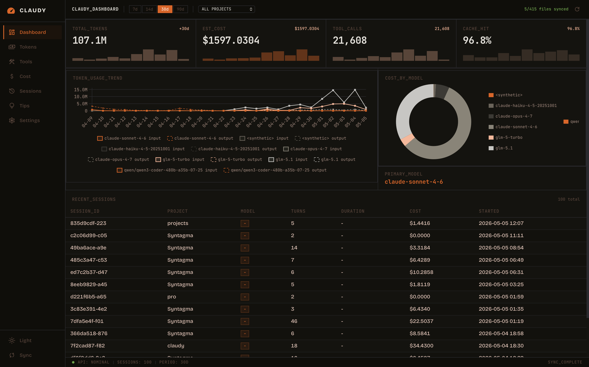

<h1 align="center">claudy</h1>

<p align="center"><b>Satu perintah. Semua penyedia. Kontrol penuh atas Claude CLI.</b></p>

<p align="center">
Berhenti memusingkan variabel lingkungan dan file konfigurasi.<br/>
Claudy memungkinkan Anda beralih antara Anthropic, Z.AI, OpenRouter, Ollama, dan endpoint kustom dengan satu perintah — menjaga kredensial, mode konfigurasi, dan framework Claude tetap terisolasi per profil.
</p>

<p align="center">
<b>Multi-penyedia · Isolasi konfigurasi · Bridge channel · Bridge agen lokal · Analitik penggunaan</b>
</p>

---

<p align="center">
  <a href="../../README.md">🇺🇸 English</a> •
  <a href="README.ko.md">🇰🇷 한국어</a> •
  <a href="README.zh-Hans.md">🇨🇳 中文</a> •
  <a href="README.ja.md">🇯🇵 日本語</a> •
  <a href="README.de.md">🇩🇪 Deutsch</a> •
  <a href="README.fr.md">🇫🇷 Français</a> •
  <a href="README.es.md">🇪🇸 Español</a> •
  <a href="README.hi.md">🇮🇳 हिन्दी</a> •
  <a href="README.pt-BR.md">🇧🇷 Português</a> •
  <a href="README.ar.md">🇸🇦 العربية</a>
</p>

<p align="center">
    <a href="https://www.rust-lang.org/"></a>
    <a href="https://crates.io/crates/claudy"></a>
    <a href="https://crates.io/crates/claudy"></a>
    <a href="../../LICENSE"></a>
    <a href="https://buymeacoffee.com/epicsaga"></a>
    <a href="https://github.com/epicsagas/claudy/actions/workflows/ci.yml"></a>
</p>

---

<picture>
  <source media="(prefers-color-scheme: dark)" srcset="../assets/features-2048.png">
  
</picture>

## Mengapa Claudy

| | Fitur | Mengapa penting |
|--|-------|-----------------|
| 🔄 | Peluncuran multi-penyedia | Beralih antara Anthropic, Z.AI, OpenRouter, Ollama, dan endpoint kustom dalam satu perintah |
| 📦 | Mode konfigurasi | Isolasi `CLAUDE.md`, pengaturan, skill, dan agen per mode — tanpa kontaminasi silang |
| 🔗 | Bridge MCP agen | Delegasikan tugas dari Claude Code ke agy, Codex, Aider, dan 20+ agen lainnya |
| 💬 | Bridge channel | Jalankan bot Telegram, Slack, dan Discord dengan prompt izin interaktif |
| 📊 | Analitik penggunaan | Lacak penggunaan token, biaya, dan pola tool dengan dasbor Tauri lokal |
| 🔐 | Kontrol proses yang aman | Penerusan SIGINT/SIGTERM, penulisan konfigurasi atomik, penyimpanan kredensial 0600 |
| 🔀 | Kontinuitas sesi lintas penyedia | Memperbaiki sesi Z.AI/GLM secara otomatis agar dapat dilanjutkan dengan Anthropic API tanpa gangguan |
| 🛠️ | UX operasional | Instal, perbarui, hapus instalasi, doctor, ping — semuanya dari satu binary |

## Penyedia yang didukung

> Claudy terinspirasi oleh [Clother](https://github.com/jolehuit/clother), peluncur multi-penyedia berbasis Go untuk Claude CLI. Z.AI telah menjadi penyedia yang paling banyak diuji. Jika Anda mengalami masalah dengan penyedia lain, silakan [buka issue](https://github.com/epicsagas/claudy/issues).

| Penyedia | Status | Catatan |
|---|---|---|
| Bawaan (Anthropic) | ✅ Teruji | Default |
| Z.AI | ✅ Teruji | |
| Alias OpenRouter | ⚠️ Eksperimental | Belum sepenuhnya teruji — laporkan masalah di GitHub |
| Ollama | ⚠️ Eksperimental | Belum sepenuhnya teruji — laporkan masalah di GitHub |
| Endpoint kustom | ⚠️ Eksperimental | Belum sepenuhnya teruji — laporkan masalah di GitHub |

<picture>
  <source media="(prefers-color-scheme: dark)" srcset="../assets/demo.gif">
  
</picture>

## Mulai cepat

**1. Instal**

macOS / Linux:

```bash
brew install epicsagas/tap/claudy
```

Tidak punya Homebrew? Gunakan skrip installer:

```bash
curl --proto '=https' --tlsv1.2 -LsSf \
  https://github.com/epicsagas/claudy/releases/latest/download/claudy-installer.sh | sh
```

Windows:

```powershell
irm https://github.com/epicsagas/claudy/releases/latest/download/claudy-installer.ps1 | iex
```

Melalui toolchain Rust:

```bash
cargo binstall claudy   # binary pre-built (cepat)
cargo install claudy    # build dari sumber
```

**2. Konfigurasi**

```bash
claudy install                        # inisialisasi direktori, konfigurasi, rahasia
echo 'ANTHROPIC_API_KEY=your-key' >> ~/.claudy/secrets.env
```

**3. Jalankan**

```bash
claudy                                # penyedia default
claudy zai                            # penyedia Z.AI
claudy openrouter sonnet              # alias OpenRouter
```

**4. Perbarui**

```bash
brew upgrade claudy          # Homebrew
claudy update                # pembaruan bawaan
# atau jalankan ulang skrip installer / cargo binstall claudy@latest
claudy --version
```

<details>
<summary>Kredensial penyedia</summary>

| Variabel | Penyedia |
|---|---|
| `ANTHROPIC_API_KEY` | Anthropic (bawaan) |
| `ZAI_API_KEY` | Z.AI |
| `ZAI_CN_API_KEY` | Z.AI China |
| `MINIMAX_API_KEY` | MiniMax |
| `MINIMAX_CN_API_KEY` | MiniMax China |
| `KIMI_API_KEY` | Kimi K2 |
| `MOONSHOT_API_KEY` | Moonshot AI |
| `ARK_API_KEY` | VolcEngine |
| `DEEPSEEK_API_KEY` | DeepSeek |
| `MIMO_API_KEY` | Xiaomi MiMo |
| `ALIBABA_API_KEY` | Alibaba Coding Plan |
| `OPENROUTER_API_KEY` | OpenRouter (semua alias) |

Penyedia kustom menggunakan variabel `api_key_env` yang didefinisikan dalam entri `custom_providers` mereka.

</details>

<details>
<summary>Skema config.yaml</summary>

Semua konfigurasi berada di `~/.claudy/config.yaml`. Hanya tambahkan bagian yang Anda butuhkan — default digunakan untuk semua yang tidak disertakan.

> Referensi lengkap: [docs/config.md](../config.md)

```yaml
# Override penyedia — timpa model dan tingkat model default per penyedia
provider_overrides:
  zai:
    model: "glm-5.1"
    model_tiers:
      haiku: "glm-4.7"                # → ANTHROPIC_DEFAULT_HAIKU_MODEL
      sonnet: "glm-5.1"               # → ANTHROPIC_DEFAULT_SONNET_MODEL
      opus: "glm-5"                   # → ANTHROPIC_DEFAULT_OPUS_MODEL

# Alias OpenRouter — jalankan dengan: claudy ou <alias>
openrouter_aliases:
  kimi: "moonshotai/kimi-k2.5"
  sonnet: "anthropic/claude-sonnet-4"

# Penyedia kompatibel Anthropic kustom — jalankan dengan: claudy <slug>
custom_providers:
  my-llm:
    name: "my-llm"
    display_name: "My Custom LLM"
    base_url: "https://my-llm.com/api/anthropic"
    api_key_env: "MY_LLM_API_KEY"
    default_model: "my-model-v1"

# Kebijakan kompaksi
compaction:
  auto_compact: true                   # default: true
  threshold: 0.8                       # 0.0–1.0, default: 0.8

# Override konteks window per model
model_settings:
  deepseek-chat:
    max_context_tokens: 64000

# Bridge channel — alternatif non-interaktif untuk `claudy channel add`
channel:
  enabled_platforms: ["telegram"]
  listen_addr: "127.0.0.1:3456"
  default_profile: "zai"
  platform_profiles:
    telegram: "zai"
  platform_allowed_users:
    telegram: ["user_id_1"]
  max_concurrent_sessions: 0           # 0 = tidak terbatas
  stream_timeout_secs: 1800

# Override agen
agents:
  aider:
    binary: "aider"
    args: ["--message", "{prompt}"]
    timeout: 300
```

</details>

---

## Konsep inti

### Profil

Target peluncuran yang menyelesaikan metadata penyedia + strategi autentikasi (penyedia bawaan, alias OpenRouter, atau penyedia kustom).

### Mode

Direktori konfigurasi Claude bernama di `~/.claudy/modes/<name>/`.

Ketika Anda menjalankan:

```bash
claudy <profile> <mode> [args...]
```

Claudy mengatur:

```bash
CLAUDE_CONFIG_DIR=~/.claudy/modes/<mode>/
```

sehingga Claude membaca file konfigurasi khusus mode.

Mode juga cocok secara alami untuk **framework dan toolkit Claude khusus** yang menyertakan `CLAUDE.md`, skill, agen, atau pengaturan mereka sendiri — seperti [gstack](https://github.com/garrytan/gstack), [superpowers](https://github.com/obra/superpowers), [ecc](https://github.com/affaan-m/everything-claude-code), atau harness kustom lainnya. Alih-alih mencemari konfigurasi default Anda, isolasi setiap framework dalam modenya sendiri:

```bash
# Buat mode khusus untuk framework
claudy mode create gstack

# Salin atau symlink konfigurasi framework ke direktori mode
cp -r /path/to/gstack/.claude/. ~/.claudy/modes/gstack/

# Jalankan Claude dengan framework tersebut aktif
claudy <profile> gstack
```

Setiap direktori mode adalah `CLAUDE_CONFIG_DIR` yang mandiri, sehingga framework tidak akan pernah saling berkonflik atau dengan pengaturan default Anda.

<details>
<summary>Referensi perintah</summary>

## Referensi perintah

### Perintah utama

- `claudy ls` (alias: `list`): daftar profil yang dikonfigurasi/diselesaikan.
- `claudy setup [provider]` (alias: `config`): penyiapan penyedia interaktif.
- `claudy show <profile>` (alias: `info`): tampilkan detail penyedia yang diselesaikan.
- `claudy ping [profile]` (alias: `test`): uji konektivitas penyedia.
- `claudy doctor` (alias: `status`): tampilkan versi, jalur, dan jumlah profil.
- `claudy sync` (alias: `install`): instal/sinkronkan binary claudy.
- `claudy update`: perbarui claudy.
- `claudy uninstall`: hapus file yang terinstal.
- `claudy mode <action> [name]`: kelola mode konfigurasi Claude.
- `claudy channel <subcommand>`: kelola bridge channel.
- `claudy mcp`: jalankan sebagai server MCP untuk bridge agen.
- `claudy analytics <subcommand>`: dasbor analitik penggunaan.
- `claudy session sanitize`: memperbaiki sesi dengan blok thinking tidak valid yang ditulis oleh penyedia non-Anthropic.

### Perintah mode

```bash
claudy mode create <name>
claudy mode ls
claudy mode remove <name>
```

Aturan nama mode: `[a-z0-9][a-z0-9_-]*` (`mode` adalah kata yang dipesan).

### Perintah channel (bridge opsional)

```bash
claudy channel serve [--profile <profile>] [--listen <host:port>]
claudy channel start [--profile <profile>] [--listen <host:port>]
claudy channel stop
claudy channel restart [--profile <profile>] [--listen <host:port>]
claudy channel status
claudy channel add <telegram|slack|discord>
claudy channel remove <telegram|slack|discord>
claudy channel enable
claudy channel disable
```

`channel add` memandu Anda melalui token bot, pengguna yang diizinkan, profil, dan pemetaan mode.

#### Platform yang didukung

| Platform | Ingestion | Tombol interaktif | Catatan |
|----------|-----------|-------------------|---------|
| Telegram | Long-polling + webhook | Inline keyboard | Paling lengkap |
| Slack | Event subscription webhook | Block Kit actions | Diverifikasi HMAC-SHA256 |
| Discord | Interaction webhook | Action row components | Diverifikasi Ed25519 |

#### Perintah bot channel

Setelah berjalan, bot merespons perintah-perintah berikut di chat:

- `/help` — Tampilkan perintah yang tersedia
- `/cancel` — Batalkan tugas saat ini
- `/model` — Ubah model Claude (tombol interaktif)
- `/yolo` — Aktifkan/nonaktifkan izin otomatis
- `/status` — Tampilkan status sesi, profil, mode, branch git, dan penggunaan token
- `/sessions` — Daftar sesi Claude terbaru (dengan tombol beralih)
- `/projects` — Daftar proyek (dengan tombol jelajahi)
- `/new` — Mulai sesi baru
- `/history` — Tampilkan riwayat sesi terbaru

Kirim teks lainnya untuk berbicara langsung dengan Claude.

#### Prompt izin

Ketika Claude meminta persetujuan untuk menggunakan tool (menjalankan perintah, mengedit file, dll.),
bot mengirimkan prompt interaktif Izinkan/Tolak ke chat Anda. Mengetuk tombol
mengirimkan respons kembali ke Claude dan pemrosesan berlanjut secara otomatis.

#### Rahasia

Simpan kredensial channel di `~/.claudy/secrets.env` (lihat [Kredensial penyedia](#kredensial-penyedia-secretsenv) untuk format lengkapnya):

```env
TELEGRAM_BOT_TOKEN=...
SLACK_BOT_TOKEN=xoxb-...
SLACK_SIGNING_SECRET=...
DISCORD_BOT_TOKEN=...
DISCORD_APPLICATION_ID=...
DISCORD_PUBLIC_KEY=...
```

</details>

## Bridge MCP agen

Jalankan `claudy mcp` untuk memulai server MCP berbasis stdio yang memungkinkan Claude Code mendelegasikan tugas ke agen coding AI lainnya yang terinstal secara lokal.

```bash
claudy mcp run        # Mulai server MCP (dipanggil oleh Claude Code)
claudy mcp install    # Daftarkan claudy sebagai server MCP di pengaturan Claude Code
claudy mcp uninstall  # Hapus claudy dari pengaturan MCP Claude Code
```

`claudy mcp install` secara otomatis mendaftarkan dirinya di `~/.claude/settings.json`. Ketika Anda membuat mode dengan `claudy mode create <name>`, ia juga mendaftar di file pengaturan mode tersebut. Tidak perlu konfigurasi manual.

Untuk mendaftar secara manual (atau di `settings.json` tingkat proyek `.claude/`):

```json
{
  "mcpServers": {
    "claudy": {
      "command": "claudy",
      "args": ["mcp"]
    }
  }
}
```

Claude Code akan melihat tool `ask_agent` yang mengekspos semua agen yang terinstal.

### Contoh penggunaan

Setelah terdaftar, Claude Code dapat mendelegasikan tugas seperti ini:

```
> Ask agy to review the error handling in src/api.rs
> Ask codex to write unit tests for the parser module
> Ask aider to refactor the database layer
```

Claude Code memilih agen yang sesuai, meneruskan prompt, dan mengembalikan hasilnya. Anda juga dapat menentukan direktori kerja:

```json
{ "agent": "agy", "prompt": "Explain this module", "working_directory": "/path/to/project" }
```

### Verifikasi pendaftaran MCP

```bash
# Periksa apakah claudy terdaftar
cat ~/.claude/settings.json | grep -A3 claudy

# Uji server MCP secara manual
echo '{"jsonrpc":"2.0","id":1,"method":"initialize","params":{}}' | claudy mcp run
```

### Agen yang didukung (otomatis terdeteksi dari PATH)

| Agen | Binary | Perintah headless |
|-------|--------|-----------------|
| Antigravity | `agy` | `agy -p "..." --output-format text` |
| Codex CLI | `codex` | `codex exec "..."` |
| Cursor Agent | `agent` | `agent -p "..." --output-format text` |
| GitHub Copilot | `copilot` | `copilot -p "..."` |
| OpenCode | `opencode` | `opencode run "..."` |
| Cline | `cline` | `cline -y "..."` |
| Aider | `aider` | `aider --message "..."` |
| Goose | `goose` | `goose run "..."` |
| Amp | `amp` | `amp --non-interactive "..."` |
| Droid | `droid` | `droid exec "..."` |
| Kiro | `kiro-cli` | `kiro-cli chat --no-interactive --trust-all-tools "..."` |
| Junie | `junie` | `junie "..."` |
| Kimi Code | `kimi` | `kimi "..."` |
| Mistral Vibe | `vibe` | `vibe "..."` |
| Qwen Code | `qwen-code` | `qwen-code "..."` |
| Crush | `crush` | `crush "..."` |
| Groq Code | `groq-code` | `groq-code --prompt "..."` |
| Plandex | `plandex` | `plandex tell "..."` |
| Kilo Code | `kilo` | `kilo "..."` |
| OpenHands | `openhands` | `openhands "..."` |

### Agen kustom

Tambahkan agen di `~/.claudy/config.yaml` di bawah kunci `agents` (lihat [Konfigurasi](#configyaml-schema) untuk skema lengkapnya):

```yaml
agents:
  my-agent:
    binary: "my-agent"
    args: ["--prompt", "{prompt}", "--no-interactive"]
    description: "My custom agent"
    timeout: 180
```

Kunci yang sama dengan agen bawaan akan menimpa defaultnya. `{prompt}` dalam `args` akan diganti dengan tugas yang sebenarnya.

## Analitik penggunaan

> **Catatan**: Fitur analitik masih dalam tahap pengembangan. Jumlah token, estimasi biaya, dan metrik lainnya mungkin belum sepenuhnya akurat. Harapkan penyempurnaan di rilis mendatang.

```bash
claudy analytics dashboard         # Buka dasbor analitik lokal (Tauri 2)
claudy analytics ingest            # Serap data sesi dari ~/.claude/projects/
claudy analytics ingest --full     # Serap ulang semua file (abaikan checkpoint)
claudy analytics ingest --project my-project  # Serap proyek tertentu
claudy analytics recommend         # Tampilkan rekomendasi penggunaan di CLI
claudy analytics export            # Ekspor data analitik (JSON, default 30 hari)
claudy analytics export --format csv --days 7  # Ekspor sebagai CSV untuk 7 hari terakhir
claudy analytics sync-pricing      # Sinkronkan harga model dari models.dev dan halaman harga Anthropic
claudy analytics recalculate       # Hitung ulang semua biaya menggunakan data harga terbaru
claudy analytics insights          # Buat ringkasan insight JSON ringkas (default: 7 hari)
claudy analytics insights --days 14  # Analisis 14 hari terakhir
claudy analytics insights --from 2026-04-01 --to 2026-04-30  # Rentang tanggal tertentu
claudy analytics insights --project my-project  # Filter berdasarkan proyek
```

### Di dalam Claude Code: `/analytics-insights`

Cara tercepat untuk menganalisis penggunaan Anda adalah langsung di dalam Claude Code. Skill `analytics-insights` tersedia secara otomatis — cukup tanyakan secara alami:

```
> /analytics-insights
> /analytics-insights last 2 weeks
> analyze my usage patterns
> 사용 패턴 분석해줘
```

Claude menjalankan `claudy analytics insights`, menganalisis JSON, dan mengembalikan laporan terstruktur dengan:

- **Tren biaya** — pengeluaran harian/mingguan dengan deteksi lonjakan
- **Distribusi model** — model mana yang Anda gunakan dan berapa biayanya per sesi
- **Pola tool** — tool yang paling sering digunakan, tingkat kesalahan, observasi efisiensi
- **Performa cache** — rasio hit dan estimasi penghematan
- **Rekomendasi yang dapat ditindaklanjuti** — saran spesifik seperti "arahkan tugas sederhana ke turbo" dengan estimasi penghematan dalam dolar

Contoh output (lihat [`docs/examples/analytics-insights-sample.json`](docs/examples/analytics-insights-sample.json) untuk data mentah):

```
#### Summary
81 sessions, $481 total spend at an average of $68.7/day. Costs trending
sharply upward — last 3 weekdays averaged $97/day.

#### Recommendations
1. Route simple tasks to glm-5-turbo — est. savings: ~$90/month
2. Investigate $1.91/turn outlier session (6x average cost-per-turn)
3. Reduce harness overhead — TaskCreate/Update accounted for ~1,000 calls
```

Tanpa perintah manual, tanpa berganti konteks. Tanyakan kepada Claude tentang penggunaan Anda dan dapatkan jawaban secara instan.

### Apa yang dilacak analitik

- **Token**: Tren detail token input, output, dan cache selama 30 hari terakhir, dikelompokkan berdasarkan model dan tanggal.
- **Tool**: Analisis distribusi yang menunjukkan tool mana yang paling sering digunakan Claude, termasuk jumlah pemanggilan, tingkat kesalahan, dan waktu eksekusi rata-rata.
- **Biaya**: Estimasi biaya penggunaan secara real-time berdasarkan harga token aktual, termasuk perkiraan harian/mingguan/bulanan dan deteksi tren (meningkat/stabil/menurun).
- **Tips (Rekomendasi)**: Saran optimasi berbasis data, seperti mendeteksi sesi berbiaya tinggi, menyarankan Haiku untuk tugas sederhana, dan mengidentifikasi percakapan panjang yang dapat diuntungkan dari ringkasan konteks.
- **Proyek**: Secara otomatis memetakan UUID sesi kriptik ke nama folder proyek yang dapat dibaca manusia untuk konteks yang lebih baik.

Data disimpan dalam database SQLite lokal di `~/.claudy/analytics/`. Dasbor berjalan sebagai aplikasi lokal Tauri 2 + Svelte berkinerja tinggi. Gunakan tombol **[Sync]** di dasbor untuk menyegarkan data secara instan dari riwayat Claude CLI Anda.

### Dasbor analitik
```bash
claudy analytics dashboard
```
<picture>
  <source media="(prefers-color-scheme: dark)" srcset="../assets/analytics-dashboard.png">
  
</picture>

---

## Kontinuitas Sesi Lintas Penyedia

Saat bekerja dengan penyedia non-Anthropic (mis. Z.AI / GLM), file JSONL sesi berisi blok thinking dengan tanda tangan kosong. Melanjutkan sesi tersebut dengan Anthropic API akan menghasilkan error:

```
API Error: 400 Invalid `signature` in `thinking` block
```

Claudy menangani ini dengan dua cara:

**Otomatis (jembatan saluran):** Saat server saluran melanjutkan sesi, server secara diam-diam mengonversi blok thinking dengan tanda tangan kosong menjadi blok teks. Tidak diperlukan tindakan apa pun.

**Manual (CLI):** Gunakan `claudy session sanitize` sebelum melanjutkan dengan `claude --resume`:

```bash
# Interaktif — pilih dari daftar sesi bermasalah
claudy session sanitize

# Filter berdasarkan nama proyek
claudy session sanitize --project book-forge

# Proses semua sesi sekaligus
claudy session sanitize --all --yes
```

**Apa yang dilakukan konversi:** Blok thinking dengan tanda tangan kosong ditulis ulang sebagai blok teks biasa, mempertahankan konten penalaran. Blok dengan tanda tangan Anthropic yang valid tidak diubah.

**Batasan:** Kontinuitas sesi bergantung pada kompatibilitas riwayat percakapan. Beralih penyedia di tengah sesi dapat menyebabkan perubahan konteks kecil meskipun sudah dilakukan sanitasi.

---

## File dan tata letak direktori

Secara default, Claudy menyimpan data di:

```text
~/.claudy/
```

File/direktori penting:

- `config.yaml`: konfigurasi penyedia + channel + agen.
- `secrets.env`: kredensial penyedia/bot.
- `launchers.json`: manifes launcher/symlink.
- `modes/`: mode konfigurasi Claude.
- `session-patches/`: penyimpanan patch sesi.
- `channel/`: status runtime channel (`pid`, sesi, log audit).
- `analytics/`: database SQLite analitik dan checkpoint.
- `cache/update.json`: cache metadata pembaruan.

## Variabel lingkungan

- `CLAUDY_HOME`: timpa direktori home Claudy (default: `~/.claudy`).
- `CLAUDE_CONFIG_DIR`: diatur secara otomatis oleh Claudy saat meluncurkan dengan mode.

## Alur kerja umum

### Konfigurasi dan jalankan penyedia

```bash
claudy setup
claudy <profile>
```

### Gunakan mode dengan penyedia

```bash
claudy mode create work
claudy <profile> work --yolo
```

> `--yolo` adalah shorthand claudy untuk `--dangerously-skip-permissions`.

### Jalankan framework Claude khusus dalam modenya sendiri

Framework seperti gstack, superpowers, atau ecc menyertakan `CLAUDE.md`, skill, dan agen mereka sendiri. Jaga agar tetap terisolasi:

```bash
# Penyiapan satu kali: buat mode dan isi dengan konfigurasi framework
claudy mode create gstack
cp -r /path/to/gstack/.claude/. ~/.claudy/modes/gstack/

# Penggunaan sehari-hari: jalankan Claude dengan framework aktif
claudy <profile> gstack
```

Beralih antara framework tanpa menyentuh konfigurasi default Anda:

```bash
claudy <profile> gstack      # framework gstack aktif
claudy <profile> superpowers # framework superpowers aktif
claudy <profile>             # konfigurasi default Anda, tidak berubah
```

### Delegasikan tugas ke agen lain melalui MCP

```bash
# 1) Pastikan MCP terdaftar (terjadi secara otomatis pada `claudy mcp` pertama)
claudy mcp

# 2) Di Claude Code, minta untuk mendelegasikan ke agen yang terinstal:
#    "Ask agy to analyze this error"
#    "Ask aider to refactor the auth module"
```

### Diagnosis status instalasi/konfigurasi

```bash
claudy doctor
claudy ping
```

## Pemecahan masalah

- **`profile not recognized`**: jalankan `claudy ls` dan pilih ID profil yang terdaftar.
- **Profil `not configured`**: jalankan `claudy setup <provider>` untuk menambahkan kredensial.
- **Status channel tidak sehat**: jalankan `claudy channel status`, lalu restart dengan `claudy channel stop` dan `claudy channel start`.
- **Bot channel tidak merespons**: periksa `~/.claudy/channel/logs/server.log` untuk kesalahan. Verifikasi token bot di `~/.claudy/secrets.env` dan pastikan `allowed_users` menyertakan ID pengguna chat Anda.
- **Prompt izin tidak muncul**: pastikan Claude CLI tidak berjalan dengan `--dangerously-skip-permissions`. Prompt hanya muncul ketika Claude membutuhkan persetujuan eksplisit untuk penggunaan tool.
- **Binary tidak ditemukan setelah instalasi**: lihat catatan PATH di bagian [Verifikasi](#verify).
- **Agen tidak muncul di MCP**: pastikan binary agen ada di `PATH` (`which agy`). Hanya agen yang terinstal yang muncul di `tools/list`.
- **Waktu habis agen**: tingkatkan timeout di field agents `config.yaml` (default: 120d).
- **MCP tidak terdaftar**: jalankan `claudy mcp` sekali secara manual, atau periksa `~/.claude/settings.json` untuk entri `mcpServers.claudy`.
- **Output agen terpotong**: stdout agen dibatasi hingga 10MB. Untuk output besar, arahkan agen untuk menulis ke file sebagai gantinya.
- **Data analitik hilang**: jalankan `claudy analytics ingest` untuk mengisi dari `~/.claude/projects/`. Gunakan `--full` untuk menyerap ulang semuanya.
- **`400 Invalid signature in thinking block` saat melanjutkan sesi**: sesi dibuat dengan penyedia non-Anthropic (mis. Z.AI). Jalankan `claudy session sanitize` untuk mengonversi blok thinking yang tidak valid, lalu lanjutkan seperti biasa.

## Pengembangan

```bash
cargo build
cargo test
cargo fmt
cargo clippy -- -D warnings

# Uji backend analitik (menggunakan DB lokal)
cargo run --example test_dashboard --features analytics-ui

# Jalankan dasbor analitik (memerlukan fitur analytics-ui)
cargo run --features analytics-ui -- analytics dashboard
```

## Berkontribusi

Kontribusi sangat diterima! Berikut cara untuk memulai:

1. Fork repositori dan buat branch fitur.
2. Buat perubahan Anda dengan pengujian jika sesuai.
3. Jalankan `cargo test && cargo clippy -- -D warnings` sebelum mengirimkan.
4. Buka Pull Request di https://github.com/epicsagas/claudy.

Laporan bug dan permintaan fitur diterima melalui [GitHub Issues](https://github.com/epicsagas/claudy/issues).

## Ucapan terima kasih

Proyek ini terinspirasi oleh [Clother](https://github.com/jolehuit/clother), peluncur multi-penyedia berbasis Go untuk Claude CLI. Claudy adalah implementasi Rust independen, didesain ulang dari awal dengan session guard berbasis RAII, penerusan sinyal, symlink launcher, dan integrasi ekosistem mendalam termasuk **Bridge Channel berfitur lengkap** (Telegram/Slack/Discord), **Agent MCP Bridge** untuk delegasi lintas-agen, dan **Dasbor Analitik berkinerja tinggi** yang dibangun dengan Tauri 2. Penambahan ini mencerminkan transisi Claudy dari peluncur sederhana menjadi toolkit operasional komprehensif untuk pengguna Claude CLI.

## Lisensi

[Apache-2.0](../../LICENSE)
